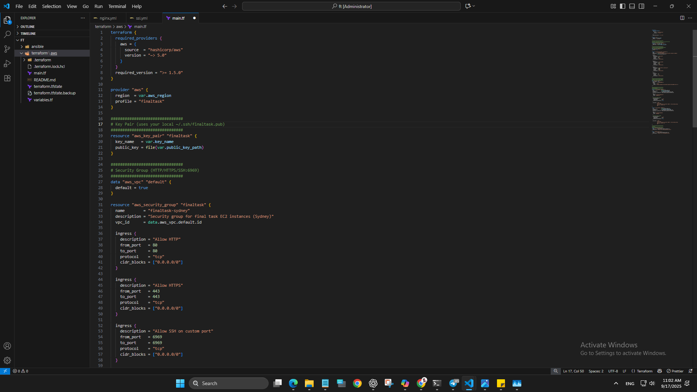
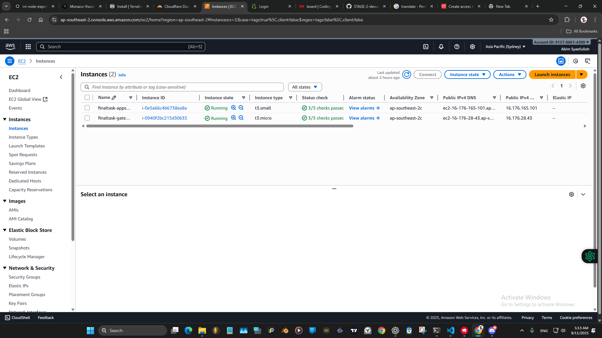
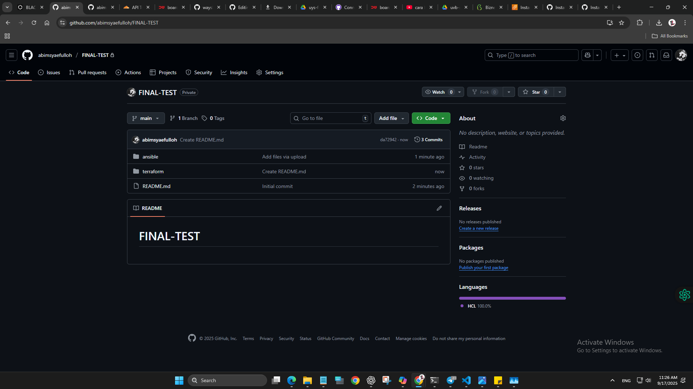
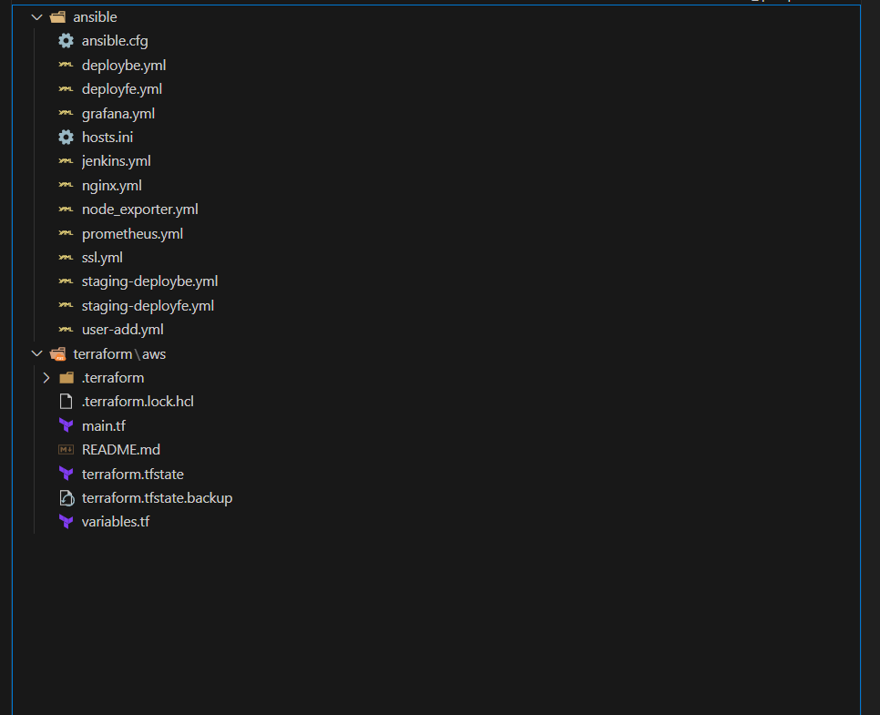

# FINAL-TEST
## === 1. Provisioning ===
### AWS configure
  

### Membuat Server dengan Terraform  
```bash
Buat file main.tf dan variables.tf untuk mendefinisikan resource:
  - Appserver: t3.small (2 CPU, 2 GB RAM)
  - Gateway: t3.micro (2 CPU, 1 GB RAM)
  - Security Group: allow port 80, 443, 6969
  - User data: ganti SSH port ke 6969
```
  

## === 2. Repository ===
### 1. Membuat Repository github 
  
### 2. Setup repository Anisble dan Terraform
```bash
├── ansible/ # Konfigurasi Ansible untuk setup server & deploy
│ ├── hosts.ini # Inventori host Ansible (gateway & appserver)
│ ├── ansible.cfg # Konfigurasi Ansible
│ ├── user-add.yml
# Playbook add user finaltask + setup dasar (SSH, UFW, dsb.)
│ ├── nginx.yml # Playbook install & konfigurasi Nginx (reverse proxy)
│ ├── prometheus.yml # Playbook deploy Prometheus (Docker container)
│ ├── grafana.yml # Playbook deploy Grafana (Docker container)
│ ├── node_exporter.yml # Playbook pasang Node Exporter (binary) di VM
│ ├── ssl.yml # Playbook setup Certbot wildcard SSL + autorenew
│ ├── deployfe.yml # Playbook deploy Frontend (Docker container) ke prod
│ ├── deploybe.yml # Playbook deploy Backend (Docker container) ke prod
│ ├── staging-deployfe.yml # Playbook deploy Frontend ke staging
│ └── staging-deploybe.yml # Playbook deploy Backend ke staging
├── terraform/ # Konfigurasi Terraform untuk provisioning
│ └── aws/
│ ├── main.tf # Definisi resource AWS (VM, Security Group, etc)
│ ├── variables.tf # Variabel Terraform (region, creds, dll)
│ 
```
  
## === 3. Nginx & Domain ===
```bash
Daftar domain :
Production :
- abimft.studentdumbways.my.id (3000)
- api.abimft.studentdumbways.my.id (5000)

Jenkins :
- pipeline.abimft.studentdumbways.my.id (8080)

Staging :
- staging.abimft.studentdumbways.my.id (3002)
- api.staging.abimft.studentdumbways.my.id (5002)

docker registry :
- registry.abimft.studentdumbways.my.id

Monitoring :
- (Grafana) monitoring.abimft.studentdumbways.my.id (3001)
- (node exporter) exporter.abimft.studentdumbways.my.id (9100)
- (prometheus) prom.abimft.studentdumbways.my.id (9090)
```

## === 4. Deployment Aplikasi ===
```bash
Deploy Aplikasi 
- Install Docker di server appserver (via Ansible). Kemudian build image Docker untuk frontend React
dan backend Golang.

- Menjalankan container PostgreSQL di appserver untuk database aplikasi. Konfigurasi Postgres dibuat agar bisa
diakses dari backend.

- Menjalankan container aplikasi Frontend dan Backend di appserver. Frontend berjalan di port 3000, 
Backend di port 5000. Variabel disesuaikan agar frontend bisa akses API backend.

- Nginx di server gateway dikonfigurasi sebagai reverse proxy untuk meneruskan trafik.
```

## === 5. Monitoring ===
```bash
- Menggunakan Node Exporter pada setiap VM untuk mengumpulkan metric OS (CPU, memori, disk,
network). 

- Menjalankan Prometheus sebagai container (di appserver) untuk mengumpulkan metric dari Node
Exporter maupun service lain.

- Menjalankan Grafana sebagai container (di appserver) untuk men- display dashboard monitoring.

- Membangun beberapa dashboard Grafana untuk memantau kesehatan sistem: penggunaan CPU,
Memory, Disk per server, traffic network, serta status service Docker. Juga dibuat dashboard khusus
monitoring aplikasi jika memungkinkan.

- Menyiapkan alerting: Metrik penting diberi threshold alarm (contoh: CPU > 80%, RAM > 90%, sisa
disk < 1GB, dsb). Menggunakan Grafana Alert atau Prometheus Alertmanager untuk mengirim
notifikasi ke Telegram apabila kondisi tercapai. 
```

## === 6. Private Docker Registry ===
```bash 
- Deploy Docker Registry (registry:2 image) sebagai private registry.
- Registry dijalankan sebagai container, diakses via domain registry.
- Image aplikasi (FE & BE) dipush ke registry ini untuk deployment. 
```
## === 7. CI/CD Pipeline (Jenkins) ===
```bash 
- Menyiapkan server Jenkins untuk menjalankan pipeline CI/CD. Jenkins diinstall (di appserver) dan
terintegrasi dengan repository Git (GitHub/GitLab).

- Dibuat 2 pipeline terpisah untuk fe-dumbmerch dan be-dumbmerch. Setiap commit/push akan otomatis
memicu pipeline.
```


